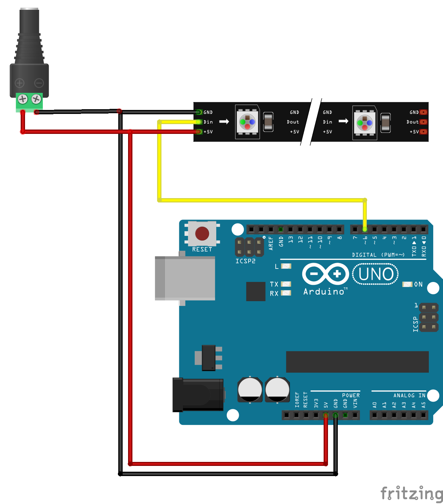
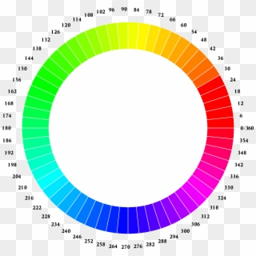

# Projekt TMP
## Opis Projektu
W projekcie chodzi o uzyskanie efektu tęczy na pasku LED.
Do budowy tego układu użyje :

*arduino uno 

*pasek led RGB WS2813

*zasilacz 5V.

*zestaw złączy 

Kod do programu zostanie napisany w programie Arduino Ide.
Kod działa na 119 ledach programowalnych.
Układ został podłoczony zgodnie z poniższym schematem: 



## Opis Kodu

```
#include <Adafruit_NeoPixel.h>  // bilbloteka z jakiej korzystałem

const int pixelPin = 6;         // pin który jest programowany
const int pixelCount = 119;     // ilość diod


Adafruit_NeoPixel strip(pixelCount, pixelPin, NEO_GRB + NEO_KHZ800);
```

W tej części kodu korzystamy z biblioteki Adafruit_NeoPixel dzięki której komunikujemy sie z paskiem LED. 
Kod zostaje wgrany na 6 pin wyjścia z Arduino i przypisane zostało 119 diod LED.
 
```
void setup()                    // komunikacja z paskiem ws2812b
{
  strip.begin();
  strip.show();
}
void loop()                     // deklaracja funkcji 
{ 
    tecza();   
}
```

W tej części komunikujemy sie z paskiem LED oraz delkarujemy funkcję o nazwie "tencza".

```
void tecza() 
{
  int period = 5000;                                            // czas jednego okresu animacji
  unsigned long progress = millis() % period;                   //czas od początku animacji w ms

  int dif = 360 / strip.numPixels();                            //dif-przesunięcie fazowe

  for(int x = 0; x < strip.numPixels(); x++) 
  {
    setHue(x, dif * (x+1) + (360.0 * progress / period));       //adresowanie i kolor poszczegolnej diody
  }

  strip.show();                                                 // prezentacja
}
```

Funkcja "tecza" zawiera czas jednego okresu animacji podanego w milisekundach poniżej jest czas od początku animacji 
dif - odpowiedzialny jest za przesunięcie fazowe aby kolory zmieniały sie płynnie, następnie adresujemy poszczególne diody i przipisujemy im odpowiedni kolor
natęnie mamy prezentację.

```
void setHue(int pixel, int hue) 
{
  hue = hue % 360;                       // hue paleta kolorów na planie kola
  int r,g,b;                             // deklaracja zmiennych r=czerwony g=zielony b=niebieski
  if(hue < 60)                           // kolor czerwony 0-60 stropni w palecie
  {
    r = 255;
    g = map(hue, 0, 59, 0, 254);
    b = 0;
  } else if(hue < 120)                   // kolor zolto-zielony 60-120 stopni w palecie
  {
    r = map(hue, 60, 119, 254, 0);
    g = 255;
    b = 0;
  } else if(hue <  180)                 // kolor zielony  120-180 stopni w palecie
  {
    r = 0;
    g = 255;
    b = map(hue, 120, 179, 0, 254);
  } else if(hue < 240)                  // kolor zielono-niebieski  180-240 stopni w palecie
  {
    r = 0;
    g = map(hue, 180, 239, 254, 0);
    b = 255;
  } else if(hue < 300)                  // kolor niebieski 240-300 stopni w palecie
  {
    r = map(hue, 240, 299, 0, 254);
    g = 0;
    b = 255;
  } else                                // kolor fioletowo-czerwony 300-360 stopni w palecie
  {
    r = 255;
    g = 0;
    b = map(hue, 300, 359, 254, 0);
  }

  strip.setPixelColor(pixel, r, g, b);
}
```

Powyższy kod odpowiedzialny jest za przypisywanie kolororów poszczególnych ledów na planie koła :



na podstawie tego planu przypisane są poszczególne kolory w zależności od podanego kąta w kodzie.
